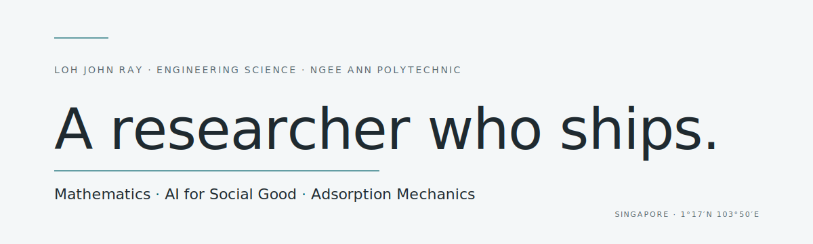

<picture>
  <source media="(prefers-color-scheme: dark)" srcset="assets/hero-dark.svg">
  
</picture>

&nbsp;

I'm a Year 3 Engineering Science student at Ngee Ann Polytechnic, working at the intersection of **deep-tech research** and **human-centred engineering**. My research sits in CO₂ adsorption — packed-bed columns, polymer-based sorbents, breakthrough-curve modelling for Direct Air Capture. My builds sit elsewhere: multimodal AI for misinformation, voice-directed surgical co-pilots, an open-source 3D-printable blood sampler for disaster and LMIC settings.

Both, at once, all the way down.

> *Mathematics is the only language I know that compresses without lying.*

&nbsp;

### Currently

— **Researching** packed-bed CO₂ adsorption with polymer sorbents; modelling breakthrough curves across PFO, LDF, and PSO kinetics.
— **Building** [SENTINEL](https://github.com/lohjo/jwj2026), [SOAR](https://github.com/lohjo/soar-main), [Lifeline / quickly-draw!](https://github.com/lohjo/hardware_projects), and a small constellation of side projects.
— **Learning** agentic orchestration, MLOps, on-device inference, and the conversational Japanese I'll need for GEIP.

&nbsp;

### Selected work

[**SENTINEL**](https://github.com/lohjo/jwj2026) — a multimodal AI-generated-content detection platform for Southeast Asia. FastAPI on Cloud Run, Gemini ensemble, SEA-LION GUARD for SEA-language coverage, Chrome extension + Telegram bot. Built in 24h at Hackomania 2026, extended for the Gemini Live Agent Challenge.

[**SOAR**](https://github.com/lohjo/soar-main) — voice-directed surgical co-pilot. One Orchestrator agent, nine specialists, 26 in-process tool functions, Vertex AI Gemini Live bridged into a browser console.

[**Lifeline / quickly-draw!**](https://github.com/lohjo/hardware_projects) — open-source 3D-printable blood sampler for disaster and low-resource settings. Vacuum-actuated bellows, microneedle array, sub-S$10 BOM, CAD released under CC-BY-4.0.

[**MathScribe**](https://github.com/lohjo/yolomolo) — handwriting-to-LaTeX, fine-tuned olmOCR VLM with QLoRA. End-to-end MLOps pipeline.

&nbsp;

### Hello, in four

Hello.&nbsp;&nbsp;&nbsp;你好。&nbsp;&nbsp;&nbsp;こんにちは。&nbsp;&nbsp;&nbsp;Xin chào.

&nbsp;

### Signals

<table>
<tr>
<td valign="top" width="50%">

<picture>
  <source media="(prefers-color-scheme: dark)" srcset="https://github-readme-stats.vercel.app/api/top-langs/?username=lohjo&layout=compact&hide_border=true&title_color=5fb3bd&text_color=e6ebed&bg_color=21282d&langs_count=6&card_width=400">
  
</picture>

</td>
<td valign="top" width="50%">

<picture>
  <source media="(prefers-color-scheme: dark)" srcset="https://streak-stats.demolab.com?user=lohjo&hide_border=true&background=21282d&stroke=5fb3bd&ring=5fb3bd&fire=5fb3bd&currStreakLabel=5fb3bd&sideLabels=97a6ad&dates=97a6ad&currStreakNum=e6ebed&sideNums=e6ebed">
  
</picture>

</td>
</tr>
</table>

&nbsp;

---

<a href="https://github.com/lohjo">github</a> &nbsp;·&nbsp;
<a href="https://www.linkedin.com/in/lohjohnray/">linkedin</a> &nbsp;·&nbsp;
<a href="https://my-website-b4twdhxhx-lohjos-projects.vercel.app/">portfolio</a>

